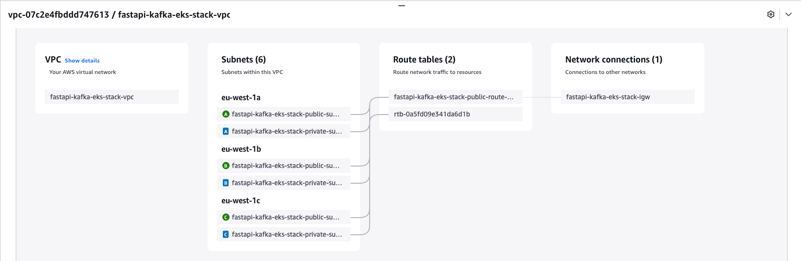

📡 AWS Network Architecture (Terraform)
```markdown

             +-----------------------------+
                        |        AWS VPC              |
                        |   CIDR: 10.0.0.0/16          |
                        |   Name: ${var.project}-vpc   |
                        +-----------------------------+
                                   |
                 +----------------+----------------+
                 |                                 |
       +-------------------+             +-------------------+
       | Internet Gateway  |             |   Route Table     |
       | Name: ${project}-igw|           | Public Subnets RT |
       +-------------------+             +-------------------+
                 |                                 |
                 |                          Routes: 0.0.0.0/0 --> IGW
                 |                                 |
          (attached to VPC)                        |
                 |                                 |
      +----------------------+                    /
      | Public Subnets (x3)  | <------------------+
      | CIDRs: 10.0.0.0/24   |
      |        10.0.1.0/24   |
      |        10.0.2.0/24   |
      | AZs:   eu-west-1a/b/c|
      +----------------------+
                 |
         Auto-assign Public IP
                 |
        Launch EC2, EKS nodes, etc.

      +----------------------+
      | Private Subnets (x3) |
      | CIDRs: 10.0.10.0/24  |
      |        10.0.11.0/24  |
      |        10.0.12.0/24  |
      | AZs:   eu-west-1a/b/c|
      +----------------------+
                 |
         No direct route to IGW
```

### VPC Resource Map

